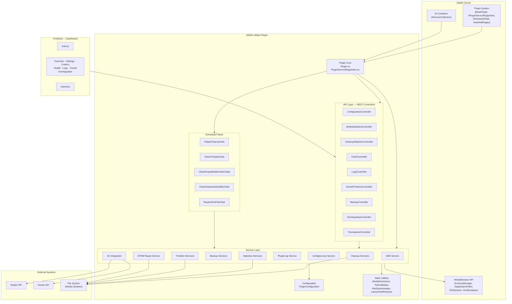
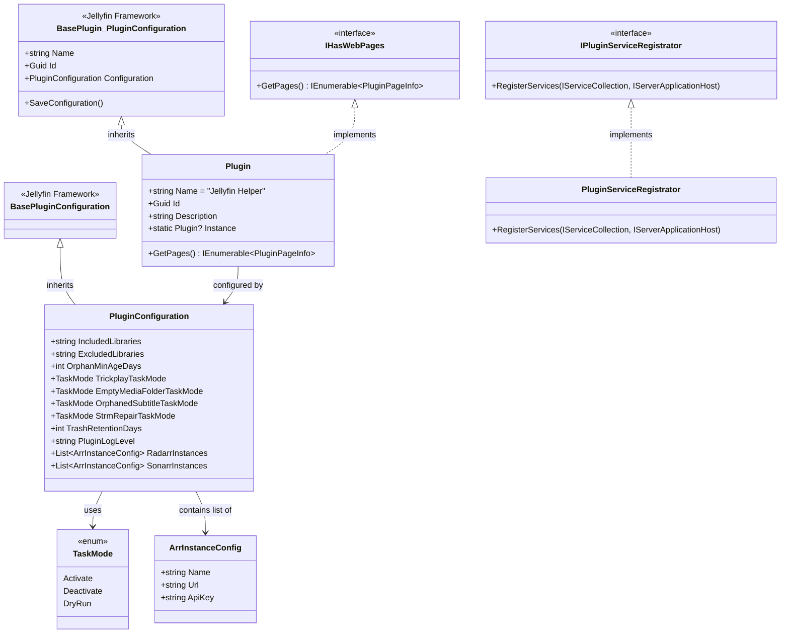
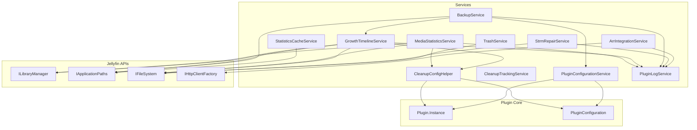
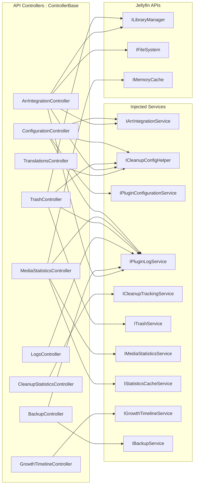
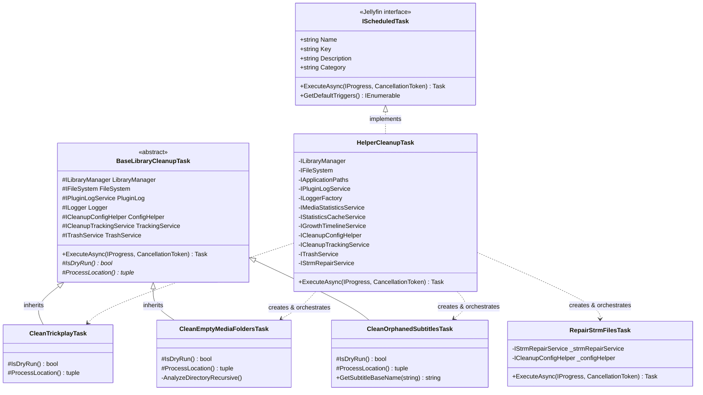
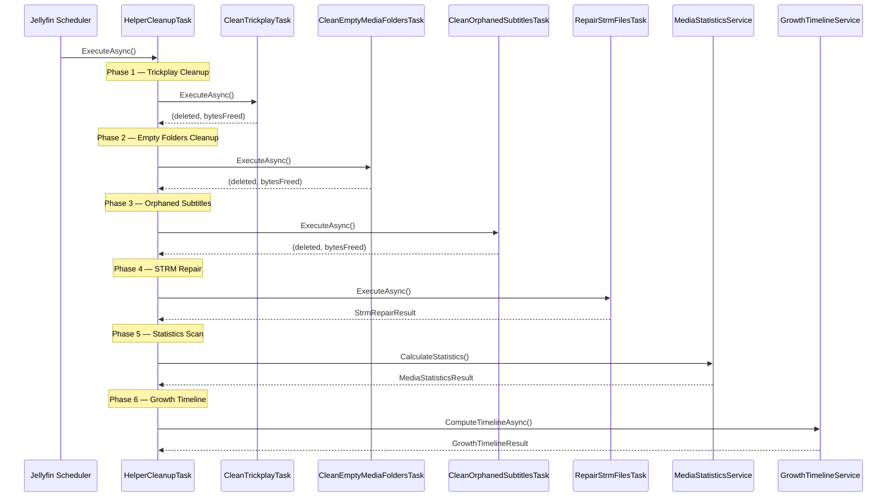
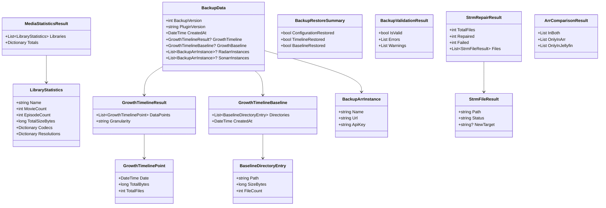

# Architecture Overview

This document describes the full architecture of the **Jellyfin Helper** plugin — layers, inheritance, interfaces, dependency injection, data flow, and design patterns.

> **Audience:** Contributors who want to understand the codebase before making changes.

---

## Table of Contents

- [High-Level Layer Architecture](#high-level-layer-architecture)
- [Plugin Core — Inheritance & Interfaces](#plugin-core--inheritance--interfaces)
- [Dependency Injection Registrations](#dependency-injection-registrations)
- [Service Layer — Interfaces & Implementations](#service-layer--interfaces--implementations)
- [Service Dependency Graph](#service-dependency-graph)
- [API Controllers — Dependencies](#api-controllers--dependencies)
- [Scheduled Tasks — Inheritance & Orchestration](#scheduled-tasks--inheritance--orchestration)
- [Task Execution Flow](#task-execution-flow)
- [Data Models / DTOs](#data-models--dtos)
- [Frontend Dashboard Architecture](#frontend-dashboard-architecture)
- [Static Utility Classes](#static-utility-classes)
- [Test Architecture](#test-architecture)
- [Design Patterns](#design-patterns)

---

## High-Level Layer Architecture



---

## Plugin Core — Inheritance & Interfaces



---

## Dependency Injection Registrations

All services are registered as **Singletons** inside `PluginServiceRegistrator.RegisterServices()`:

| Interface | Implementation | Notes |
|---|---|---|
| `ICleanupConfigHelper` | `CleanupConfigHelper` | |
| `ICleanupTrackingService` | `CleanupTrackingService` | |
| `ITrashService` | `TrashService` | |
| `IPluginConfigurationService` | `PluginConfigurationService` | |
| `IPluginLogService` | `PluginLogService` | |
| `IMediaStatisticsService` | `MediaStatisticsService` | |
| `IStatisticsCacheService` | `StatisticsCacheService` | |
| `IGrowthTimelineService` | `GrowthTimelineService` | also `IDisposable` |
| `IBackupService` | `BackupService` | |
| `IStrmRepairService` | `StrmRepairService` | |
| `IArrIntegrationService` | `ArrIntegrationService` | |
| Named `HttpClient` | `"ArrIntegration"` | 15 s timeout |

---

## Service Layer — Interfaces & Implementations

```mermaid
classDiagram
    class ICleanupConfigHelper {
        <<interface>>
        +GetConfig() PluginConfiguration
        +GetTrickplayTaskMode() TaskMode
        +GetEmptyMediaFolderTaskMode() TaskMode
        +GetOrphanedSubtitleTaskMode() TaskMode
        +GetStrmRepairTaskMode() TaskMode
        +IsDryRunTrickplay() bool
        +IsDryRunEmptyMediaFolders() bool
        +IsDryRunOrphanedSubtitles() bool
        +IsDryRunStrmRepair() bool
        +GetFilteredLibraryLocations() IReadOnlyList
        +IsOldEnoughForDeletion(string) bool
        +GetTrashPath(string) string
    }

    class ICleanupTrackingService {
        <<interface>>
        +RecordCleanup(long, int, ILogger)
        +GetStatistics() tuple
    }

    class ITrashService {
        <<interface>>
        +MoveToTrash(string, string, ILogger, DateTime?)
        +MoveFileToTrash(string, string, ILogger, DateTime?)
        +PurgeExpiredTrash() tuple
        +GetTrashSummary(string) tuple
        +GetTrashContents(string, int) IReadOnlyList
    }

    class IPluginConfigurationService {
        <<interface>>
        +GetConfiguration() PluginConfiguration
        +SaveConfiguration()
    }

    class IPluginLogService {
        <<interface>>
        +LogDebug / LogInfo / LogWarning / LogError
        +GetEntries() ReadOnlyCollection
        +GetCount() int
        +Clear()
        +ExportAsText() string
    }

    class IMediaStatisticsService {
        <<interface>>
        +CalculateStatistics() MediaStatisticsResult
    }

    class IStatisticsCacheService {
        <<interface>>
        +SaveLatestResult(MediaStatisticsResult)
        +LoadLatestResult() MediaStatisticsResult?
    }

    class IGrowthTimelineService {
        <<interface>>
        +ComputeTimelineAsync(CancellationToken) Task
        +LoadTimelineAsync(CancellationToken) Task
    }

    class IBackupService {
        <<interface>>
        +CreateBackup() BackupData
        +RestoreBackup(BackupData) BackupRestoreSummary
    }

    class IStrmRepairService {
        <<interface>>
        +RepairStrmFiles() StrmRepairResult
    }

    class IArrIntegrationService {
        <<interface>>
        +TestConnectionAsync() Task
        +GetRadarrMoviesAsync() Task
        +GetSonarrSeriesAsync() Task
    }

    class CleanupConfigHelper
    class CleanupTrackingService
    class TrashService
    class PluginConfigurationService
    class PluginLogService
    class MediaStatisticsService
    class StatisticsCacheService
    class GrowthTimelineService
    class BackupService
    class StrmRepairService
    class ArrIntegrationService

    ICleanupConfigHelper <|.. CleanupConfigHelper
    ICleanupTrackingService <|.. CleanupTrackingService
    ITrashService <|.. TrashService
    IPluginConfigurationService <|.. PluginConfigurationService
    IPluginLogService <|.. PluginLogService
    IMediaStatisticsService <|.. MediaStatisticsService
    IStatisticsCacheService <|.. StatisticsCacheService
    IGrowthTimelineService <|.. GrowthTimelineService
    IBackupService <|.. BackupService
    IStrmRepairService <|.. StrmRepairService
    IArrIntegrationService <|.. ArrIntegrationService
```



---

## Service Dependency Graph

Shows which Jellyfin APIs and internal services each implementation depends on.



---

## API Controllers — Dependencies

All controllers inherit from `ControllerBase` and require admin authorization (`RequiresElevation`).

| Controller | Route | Injected Dependencies |
|---|---|---|
| `ConfigurationController` | `/JellyfinHelper/Configuration` | `IArrIntegrationService`, `ICleanupConfigHelper`, `IPluginConfigurationService`, `IPluginLogService` |
| `MediaStatisticsController` | `/JellyfinHelper/MediaStatistics` | `IMediaStatisticsService`, `IStatisticsCacheService`, `IPluginLogService`, `IMemoryCache` |
| `CleanupStatisticsController` | `/JellyfinHelper/CleanupStatistics` | `ICleanupTrackingService` |
| `TrashController` | `/JellyfinHelper/Trash` | `ITrashService`, `ICleanupConfigHelper`, `IPluginLogService`, `ILibraryManager` |
| `LogsController` | `/JellyfinHelper/Logs` | `IPluginLogService` |
| `GrowthTimelineController` | `/JellyfinHelper/GrowthTimeline` | `IGrowthTimelineService` |
| `BackupController` | `/JellyfinHelper/Backup` | `IBackupService`, `IPluginLogService` |
| `ArrIntegrationController` | `/JellyfinHelper/ArrIntegration` | `IArrIntegrationService`, `ICleanupConfigHelper`, `IPluginLogService`, `ILibraryManager`, `IFileSystem` |
| `TranslationsController` | `/JellyfinHelper/Translations` | `ICleanupConfigHelper` |



---

## Scheduled Tasks — Inheritance & Orchestration



---

## Task Execution Flow

`HelperCleanupTask` is the single registered `IScheduledTask`. It orchestrates all sub-tasks sequentially:



---

## Data Models / DTOs



---

## Frontend Dashboard Architecture

The plugin page is served via `IHasWebPages`. `main.js` acts as a router, loading tab modules on demand. All modules share `shared.js` for API calls, formatting, and i18n.

```mermaid
graph TD
    subgraph HTML["configPage.html (IHasWebPages)"]
        PAGE["Embedded Plugin Page"]
    end

    subgraph JS["JavaScript Modules (docs/js/)"]
        MAIN["main.js — Router & Tab Management"]
        SHARED["shared.js — API Helper, Formatting, i18n"]
        OV["Overview.js"]
        SET["Settings.js"]
        COD["Codecs.js"]
        HLT["Health.js"]
        LOG["Logs.js"]
        TRD["Trends.js"]
        ARR["ArrIntegration.js"]
    end

    subgraph API["REST API Endpoints"]
        E1["/JellyfinHelper/Configuration"]
        E2["/JellyfinHelper/MediaStatistics"]
        E3["/JellyfinHelper/CleanupStatistics"]
        E4["/JellyfinHelper/Trash"]
        E5["/JellyfinHelper/Logs"]
        E6["/JellyfinHelper/GrowthTimeline"]
        E7["/JellyfinHelper/Backup"]
        E8["/JellyfinHelper/ArrIntegration"]
        E9["/JellyfinHelper/Translations"]
    end

    PAGE --> MAIN
    MAIN --> SHARED
    MAIN --> OV
    MAIN --> SET
    MAIN --> COD
    MAIN --> HLT
    MAIN --> LOG
    MAIN --> TRD
    MAIN --> ARR

    OV --> SHARED
    SET --> SHARED
    COD --> SHARED
    HLT --> SHARED
    LOG --> SHARED
    TRD --> SHARED
    ARR --> SHARED

    OV -->|fetch| E2
    OV -->|fetch| E3
    SET -->|fetch| E1
    SET -->|fetch| E7
    COD -->|fetch| E2
    HLT -->|fetch| E4
    LOG -->|fetch| E5
    TRD -->|fetch| E6
    ARR -->|fetch| E8
    MAIN -->|fetch| E9
```



---

## Static Utility Classes

These classes are **not registered in DI** — they are static helpers used directly by services and tasks.

| Class | Purpose | Used by |
|---|---|---|
| `MediaExtensions` | Video, audio, subtitle, image, NFO file extension sets | `StrmRepairService`, `CleanOrphanedSubtitlesTask`, `MediaStatisticsService` |
| `PathValidator` | `IsSafePath()`, `SanitizeFileName()` — path traversal protection | `TrashService`, `StrmRepairService` |
| `FileSystemHelper` | `CalculateDirectorySize()`, `IncrementCount()` | `MediaStatisticsService` |
| `LibraryPathResolver` | `GetDistinctLibraryLocations()` | `GrowthTimelineService` |
| `TimelineAggregator` | Bucket calculation, date-range aggregation | `GrowthTimelineService` |
| `I18NService` | `GetTranslations()` — loads embedded JSON resources | `TranslationsController` |
| `JsonDefaults` | Shared `JsonSerializerOptions` | `BackupService`, `StatisticsCacheService` |
| `ConfigurationRequestValidator` | Validates incoming configuration requests | `ConfigurationController` |
| `BackupValidator` | Validates backup JSON structure before restore | `BackupController` |
| `BackupSanitizer` | Sanitizes imported backup data | `BackupController` |

---

## Test Architecture

```
Jellyfin.Plugin.JellyfinHelper.Tests/
├── Api/                          # Controller tests
├── Configuration/                # Configuration model tests
├── PluginPages/                  # Page registration tests
├── ScheduledTasks/               # Task execution tests
├── Services/
│   ├── Backup/
│   │   └── BackupServicePerformanceTests.cs
│   ├── Cleanup/
│   │   └── TrashServiceSecurityTests.cs
│   ├── Strm/
│   │   └── StrmRepairSecurityTests.cs
│   └── Timeline/
│       └── GrowthTimelineServiceTests.cs
└── TestFixtures/                 # Shared test helpers
```

---

## Design Patterns

| Pattern | Where | Description |
|---|---|---|
| **Template Method** | `BaseLibraryCleanupTask` | Abstract base defines execution order; concrete tasks implement `IsDryRun()` and `ProcessLocation()` only |
| **Dependency Injection** | `PluginServiceRegistrator` | All services registered as singletons via interfaces |
| **Singleton** | `Plugin.Instance` | Static plugin instance for global configuration access |
| **Strategy** | `TaskMode` enum | Runtime behavior (Activate / DryRun / Deactivate) configurable per cleanup task |
| **Facade** | `HelperCleanupTask` | Orchestrates all sub-tasks behind a single `IScheduledTask` |
| **Repository / Cache** | `StatisticsCacheService` | Persists scan results as JSON files |
| **Validator** | `BackupValidator`, `ConfigurationRequestValidator` | Separate validation classes for input data |
| **Sanitizer** | `BackupSanitizer` | Cleanses imported data before processing |