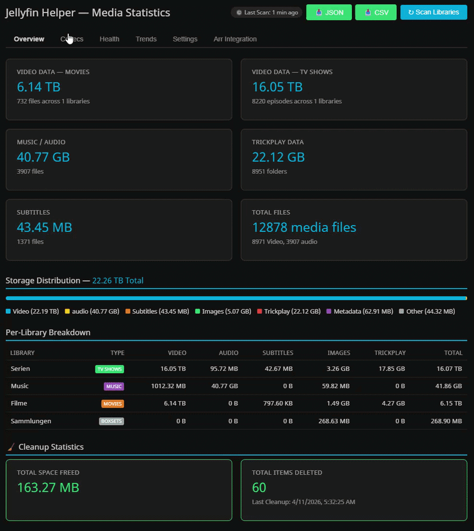

# Jellyfin Helper


A [Jellyfin](https://jellyfin.org/) plugin that provides automated cleanup tasks, media library statistics, health checks, and Arr stack integration — all from a single, multi-tab dashboard.

## 📸 Screenshots



## Features

### 📊 Multi-Tab Dashboard

The plugin provides a **6-tab dashboard** directly in the Jellyfin sidebar:

| Tab | Description |
|-----|-------------|
| **Overview** | Per-library disk usage breakdown (video, audio, subtitle, image, NFO, trickplay, other) with file counts and sizes |
| **Codecs** | Video codec, audio codec, container format, and resolution analysis with donut charts and clickable file lists |
| **Health** | Health checks detecting missing subtitles, missing artwork, missing NFO, and orphaned metadata directories |
| **Trends** | Historical library growth trend graph from up to 365 daily snapshots |
| **Settings** | Full plugin configuration UI with task modes, trash settings, language selector, and Arr instances |
| **Arr** | Radarr/Sonarr library comparison with instance selection and connection testing |

The dashboard loads **persisted scan results** on page open — no scan required to see the last result. Results survive server restarts.

---

### 🧹 Trickplay Folder Cleaner
Automatically deletes orphaned `.trickplay` folders that no longer have a corresponding media file. This typically happens when media files are renamed, moved, or deleted while the trickplay data remains behind.

### 📁 Empty Media Folder Cleaner
Automatically deletes top-level media folders whose entire directory tree contains files but absolutely **no video files**. This targets the common scenario where a movie or episode is deleted but the surrounding folder with metadata (`.nfo`), artwork (`.jpg`), subtitles (`.srt`), etc. remains as an orphaned folder.

**Important behaviors:**
- **Completely empty folders are skipped** — they are often pre-created by tools like Radarr/Sonarr for upcoming/"wanted" media
- **TV show folders are checked as a whole** — if at least one video exists anywhere in the tree (even in a deeply nested subdirectory), the entire show folder is kept untouched
- **Metadata-only folders are skipped** — folders containing only `.nfo` and image files (common for Radarr/Sonarr wanted-list placeholders) are not deleted
- **`.trickplay` folders are skipped** — they are handled by the Trickplay Folder Cleaner task

### 🧹 Orphaned Subtitle Cleaner
Automatically detects and removes orphaned subtitle files (`.srt`, `.sub`, `.ssa`, `.ass`, `.vtt`, etc.) that no longer have a corresponding video file in the same directory. This commonly occurs when media files are replaced, moved, or deleted while leftover subtitles remain behind.

Uses explicit **ISO 639-1 / ISO 639-2 language code allowlists** and subtitle flag detection (`forced`, `sdh`, `hi`, `cc`, etc.) to avoid false positives from tokens like "DTS", "HDR", or "S01".

### 🔧 STRM File Repair
Automatically detects and repairs broken `.strm` files whose referenced media file has been renamed or moved. When a `.strm` file points to a non-existent path, the plugin searches the parent directory for a matching media file and updates the path. URL-based `.strm` files (e.g. `http://`, `rtsp://`) are left untouched.

---

### 📊 Media Library Statistics
A comprehensive overview of your media library disk usage:
- **Video Data in Movies** / **Video Data in Series** / **Audio Data in Music**
- **Trickplay Data**, **Subtitle Data**, **Image Data**, **NFO/Metadata Data**, **Other Files**
- Per-library breakdown with file counts
- **Video Codec Analysis** — HEVC, H.264, AV1, VP9, XviD, DivX, MPEG parsed from filenames, with clickable file lists per codec
- **Audio Codec Analysis (Video)** — AAC, FLAC, MP3, Opus, DTS, AC3, TrueHD, Vorbis, ALAC, PCM, WMA, APE, WavPack, DSD — parsed from video filenames
- **Audio Codec Analysis (Music)** — Separate codec breakdown for music libraries using filename tags with extension-based fallback
- **Container Formats** — MKV, MP4, AVI, WebM etc. with file count and size
- **Resolution Distribution** — 4K, 1080p, 720p, 480p, 576p
- **Codec File Paths** — Each codec/format/resolution entry tracks individual file paths for drill-down inspection

### 🏥 Health Check
- **Videos without subtitles** — Detects videos with neither external subtitle files nor **embedded subtitle streams**
- **Videos without artwork** — Missing poster/image files
- **Videos without NFO** — Missing metadata files
- **Orphaned metadata directories** — Folders containing only metadata but no video
- **Clickable items** — Health issues show full paths and are clickable for details
- **Boxset/Collection libraries** are automatically skipped for health checks

### 📈 Export & History
- **Export as JSON** — Download complete statistics as a JSON file (all fields including codec paths and health detail paths)
- **Export as CSV** — Download per-library breakdown as a CSV file with all codec/resolution/health fields
- **Historical Trend** — Statistics are saved as a snapshot on every scan (max. 365 entries) and displayed as a trend graph
- **Persisted Latest Result** — The most recent scan result is persisted to disk and automatically loaded on dashboard open, surviving server restarts

### 🗑️ Trash / Recycle Bin
Instead of permanently deleting files, the plugin can move them to a configurable trash folder with timestamped names. Items in the trash are automatically purged after a configurable retention period (default: 30 days). This provides a safety net before permanent deletion.

- **Detailed trash contents** — View trashed items per library with original name, size, trashed date, and expected purge date
- **Trash folder management** — View, list, and delete trash folders from the UI
- **Disable dialog** — When disabling trash, a dialog shows which folders exist and offers to delete them
- **Path safety checks** — Refuses to delete filesystem roots, library roots, or paths with traversal attacks

### 🔗 Arr Stack Integration
Compare your Jellyfin library with Radarr and Sonarr to identify:
- Items present in both systems
- Items in the Arr app but not in Jellyfin (with or without files)
- Items in Jellyfin but missing from the Arr app

**Multi-Instance Support:**
- Up to **3 Radarr** and **3 Sonarr** instances simultaneously (e.g. "Radarr 4K", "Radarr Anime")
- Per-instance comparison or merged view across all instances
- **Connection Test** — Test button validates URL + API key before saving
- Automatic migration from legacy single-instance configuration

### 🌐 Internationalization (i18n)
The entire dashboard UI — including the Settings page, all tabs, and all badges — supports **7 languages**: English, German, French, Spanish, Portuguese, Chinese, and Turkish. The language can be changed in the Settings tab and takes effect immediately (full UI rebuild).

### ⚙️ Configurable Library Filtering
- **Whitelist / Blacklist** — Include or exclude specific libraries from cleanup tasks
- **Orphan Minimum Age** — Protect recently created items from premature deletion (race condition protection for active downloads)
- **Music & Boxset Protection** — Music libraries and Boxset/Collection folders are automatically excluded from cleanup

### 🔐 Security & Performance
- **5-Minute Cache** — Statistics are cached with `IMemoryCache`; repeated clicks do not trigger a new scan
- **Rate Limiting** — Minimum 30 seconds between scans; HTTP 429 returned on excessive requests
- **Input Validation** — Path traversal protection with null-byte detection and base directory validation
- **XSS Protection** — HTML escaping in badge rendering and configuration page
- **Graceful Handling** — `IOException` and `UnauthorizedAccessException` are logged and skipped per directory
- **Trash Path Safety** — Rejects filesystem roots, library roots, and `..` traversal in trash deletion

### ⚙️ Task Modes
Each cleanup/repair task can be individually configured with one of three modes:
- **Activate** — Performs the actual cleanup/repair operations
- **Deactivate** — Skips the task entirely during scheduled runs
- **Dry Run** — Logs what *would* happen without making any changes (default for all tasks)

A **unified `TaskMode` system** replaces the legacy per-task boolean flags. Existing configurations are automatically migrated on first load via `ConfigVersion`.

---

## Scheduled Tasks

| Task | Description | Default Schedule |
|------|-------------|-----------------|
| **Helper Cleanup** | Master task that orchestrates all sub-tasks sequentially | Weekly, Sunday 3:00 AM |

The **Helper Cleanup** task runs the following sub-tasks in order, each respecting its configured task mode:
1. Trickplay Folder Cleanup
2. Empty Media Folder Cleanup
3. Orphaned Subtitle Cleanup
4. STRM File Repair
5. Trash Purge (if trash is enabled)
6. **Post-Cleanup Statistics Scan** — Automatically refreshes and persists statistics after cleanup

All tasks appear under the **Jellyfin Helper** category in the Jellyfin scheduled tasks dashboard.

---

## API Endpoints

| Endpoint | Method | Description |
|----------|--------|-------------|
| `/JellyfinHelper/Statistics` | GET | Retrieve statistics (cached for 5 min; use `?forceRefresh=true` to bypass cache) |
| `/JellyfinHelper/Statistics/Latest` | GET | Get latest persisted statistics without triggering a new scan (survives restarts) |
| `/JellyfinHelper/Statistics/Export/Json` | GET | Download statistics as a JSON file |
| `/JellyfinHelper/Statistics/Export/Csv` | GET | Download statistics as a CSV file |
| `/JellyfinHelper/Statistics/History` | GET | Retrieve historical snapshots for trend graph |
| `/JellyfinHelper/Translations` | GET | Get UI translations for specified language |
| `/JellyfinHelper/Configuration` | GET/POST | Get or update plugin settings |
| `/JellyfinHelper/Libraries` | GET | Get available library names for configuration |
| `/JellyfinHelper/Cleanup/Statistics` | GET | Get accumulated cleanup statistics |
| `/JellyfinHelper/Trash/Summary` | GET | Get trash folder summary across libraries |
| `/JellyfinHelper/Trash/Contents` | GET | Get detailed trash contents per library (name, size, dates) |
| `/JellyfinHelper/Trash/Folders` | GET | List existing trash folder paths on disk |
| `/JellyfinHelper/Trash/Folders` | DELETE | Delete all existing trash folders from disk |
| `/JellyfinHelper/Arr/TestConnection` | POST | Test connection to a Radarr/Sonarr instance |
| `/JellyfinHelper/Arr/Radarr/Compare` | GET | Compare Jellyfin movies with Radarr (optional `?index=N` for specific instance) |
| `/JellyfinHelper/Arr/Sonarr/Compare` | GET | Compare Jellyfin TV shows with Sonarr (optional `?index=N` for specific instance) |

All endpoints require admin authorization (`RequiresElevation`) except `/Translations` (anonymous).

---

## Configuration Options

| Setting | Description | Default |
|---------|-------------|---------|
| **Included Libraries** | Whitelist of library names (comma-separated) | Empty (all) |
| **Excluded Libraries** | Blacklist of library names (comma-separated) | Empty (none) |
| **Orphan Minimum Age** | Minimum age (days) before an item is considered orphaned | 0 |
| **Trickplay Task Mode** | Mode for trickplay cleanup (Activate / DryRun / Deactivate) | DryRun |
| **Empty Folder Task Mode** | Mode for empty media folder cleanup | DryRun |
| **Subtitle Task Mode** | Mode for orphaned subtitle cleanup | DryRun |
| **STRM Repair Task Mode** | Mode for STRM file repair | DryRun |
| **Use Trash** | Move to trash instead of permanent delete | Off |
| **Trash Folder Path** | Relative or absolute path to the trash folder | `.jellyfin-trash` |
| **Trash Retention** | Days to keep items in trash before purging | 30 |
| **Dashboard Language** | UI language (en, de, fr, es, pt, zh, tr) | en |
| **Radarr Instances** | Up to 3 Radarr instances with name, URL, and API key | Empty |
| **Sonarr Instances** | Up to 3 Sonarr instances with name, URL, and API key | Empty |

---

## Supported File Extensions

### Video
`.3g2` `.3gp` `.asf` `.avi` `.divx` `.dvr-ms` `.f4v` `.flv` `.hevc` `.img` `.iso` `.m2ts` `.m2v` `.m4v` `.mk3d` `.mkv` `.mov` `.mp4` `.mpeg` `.mpg` `.mts` `.ogm` `.ogv` `.rec` `.rm` `.rmvb` `.ts` `.vob` `.webm` `.wmv` `.wtv`

### Audio
`.flac` `.mp3` `.ogg` `.opus` `.wav` `.wma` `.m4a` `.aac` `.ape` `.wv` `.dsf` `.dff` `.mka`

### Subtitle
`.srt` `.sub` `.ssa` `.ass` `.vtt` `.idx` `.smi` `.pgs` `.sup`

### Image
`.jpg` `.jpeg` `.png` `.gif` `.bmp` `.webp` `.tbn` `.ico` `.svg`

---

## Installation

### From Repository (Recommended)

1. In Jellyfin, go to **Dashboard** → **Plugins** → **Repositories**
2. Add this repository URL:
   ```
   https://raw.githubusercontent.com/JellyPlugins/jellyfin-helper/main/manifest.json
   ```
3. Go to **Catalog** and install **Jellyfin Helper**
4. Restart Jellyfin

### Manual Installation

1. Download the latest release from the [Releases](https://github.com/JellyPlugins/jellyfin-helper/releases) page
2. Extract the `.dll` file into your Jellyfin plugins directory (e.g., `/config/plugins/JellyfinHelper/`)
3. Restart Jellyfin

---

## Usage

1. After installation, the plugin appears in the **Jellyfin sidebar menu** — click **Jellyfin Helper** to open the dashboard
2. The dashboard loads the **last persisted scan** automatically — no manual scan required
3. Visit the **Settings** tab to configure task modes, library filtering, trash, language, and Arr instances
4. All tasks default to **Dry Run** mode — check the Jellyfin logs to review what would be affected
5. Once satisfied, switch individual tasks to **Activate** mode in the Settings tab
6. Go to **Dashboard** → **Scheduled Tasks** and find **Helper Cleanup** under the **Jellyfin Helper** category
7. Run the task manually or let it run on its weekly schedule
8. Use the **Overview**, **Codecs**, and **Health** tabs to inspect your library
9. Use the **Trends** tab to track library growth over time
10. Use the **Arr** tab to compare your library with Radarr/Sonarr instances

---

## Building from Source

```bash
dotnet build
dotnet test
```

The project includes **573 automated tests** covering all services, API endpoints, configuration migration, UI structure, and serialization roundtrips.

### Modular Build System

The dashboard UI is assembled at build time via a custom `ComposeConfigPage` MSBuild target. Each tab has its own dedicated CSS and JS module:

```text
PluginPages/
├── css/
│   ├── shared.css          # Common styles (file lists, modals, layout)
│   ├── Codecs.css          # Codec tab charts & file explorer
│   ├── Health.css          # Health check tiles & detail panel
│   └── ArrIntegration.css  # Arr comparison tables
└── js/
    ├── shared.js           # Utilities (formatting, renderFileList, getFileName)
    ├── main.js             # Tab routing, scan trigger, i18n loader
    ├── Overview.js         # Overview tab (disk usage bars)
    ├── Codecs.js           # Codec tab (donut charts, file drill-down)
    ├── Health.js           # Health tab (tiles, clickable details, trash section)
    └── ...
```

These are concatenated into the final `configPage.html` during `dotnet build`, keeping the source modular while delivering a single file to Jellyfin.

## Changelog

See [CHANGELOG.md](CHANGELOG.md) for a detailed version history.

## Origin

This project is based on the original [jellyfin-trickplay-folder-cleaner](https://github.com/Noir1992/jellyfin-trickplay-folder-cleaner) by [@Noir1992](https://github.com/Noir1992), which was inspired by [this community script](https://github.com/jellyfin/jellyfin/issues/12818#issuecomment-2712783498).

This fork evolved into an independent project with significant additions including empty media folder cleanup, orphaned subtitle cleanup, STRM file repair, media library statistics with codec/resolution/container analysis, audio codec analysis (separate for video and music), health checks with embedded subtitle detection, export/history/trend features, trash/recycle bin with detailed contents UI, multi-instance Arr stack integration with connection testing, multi-language dashboard (7 languages), persisted scan results, caching, rate limiting, XSS protection, comprehensive test coverage, CI/CD pipeline with integration tests, and Dependabot/CodeRabbit integration.

## License

This project is licensed under the GNU General Public License v3.0 - see the [LICENSE](LICENSE) file for details.

## Acknowledgements
[@Noir1992](https://github.com/Noir1992) — Original plugin author<br />
[@K-Money](https://github.com/K-Money) — Initial Testing